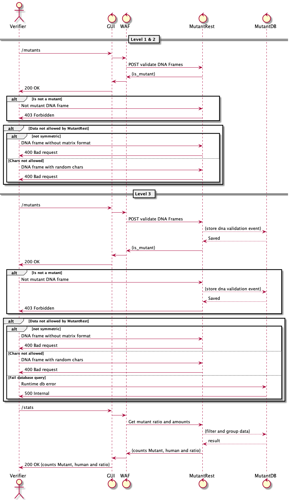

# mutants
Mutants DNA validation 

## Deploy settings:

###Docker:
Inside the project you will find the description and settings of `Dockerfile` and `docker-compose.yml`

###Manual: 

#### Minimal server requirements

- Ubuntu server 16.04 LTS x64 or Higher
- 1 CPU / 512Mb memory
- openjdk:8-jre-alpine
- Mongodb 3.5.x or Higher

Instructions
- Import the code and create a new linux services
- Change to 
`
cd /mutants
`
- Compiles project 
`
  ./gradlew clean build --stacktrace  
`
- Create a services file from example file `mutant.service`
- Reload service deamon `systemctl daemon-reload`
- Start mutant service `sudo service mutant-api start`
- Verfied service running `systemctl status mutant-api.service`

## Sequence diagram 
