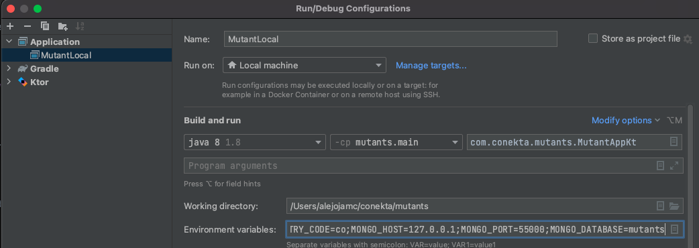
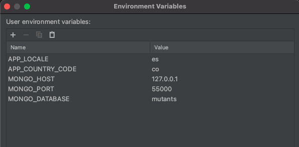
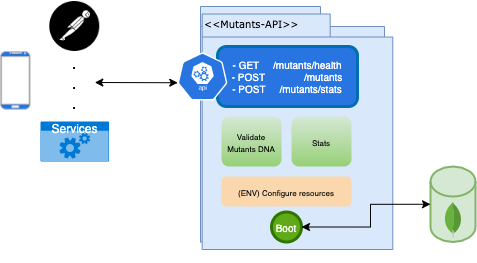

# mutants
Mutants DNA validation 

## Local settings:
Create an `Application` config file to execute the project in local using Intellij IDE.

And set local environment variables:

- APP_LOCALE=es 
- APP_COUNTRY_CODE=co
- MONGO_HOST=127.0.0.1
- MONGO_PORT=27017
- MONGO_DATABASE=mutants

Note: the level3 brand and main required a mongodb running en local to run.

## Local resources:

- Postman collection: `./docs/postman/Mutants.postman_collection.json`

This collection requires a environment `{{server}}` example: `server = http://localhost:8080`

## Deploy settings:

### Docker:
Inside the project you will find the description and settings of `Dockerfile` and `docker-compose.yml`

### Manual:

#### Minimal server requirements

- Ubuntu server 16.04 LTS x64 or Higher
- 1 CPU / 512Mb memory
- openjdk:8-jre-alpine
- Mongodb 3.5.x or Higher

Instructions
- Import the code and create a new linux services
- Change to 
`
cd /mutants
`
- Compiles project 
`
  ./gradlew clean build --stacktrace  
`
- Create a services file from example file `mutant.service`
- Reload service deamon `systemctl daemon-reload`
- Start mutant service `sudo service mutant-api start`
- Verfied service running `systemctl status mutant-api.service`

## Architecture

## Sequence diagram 

